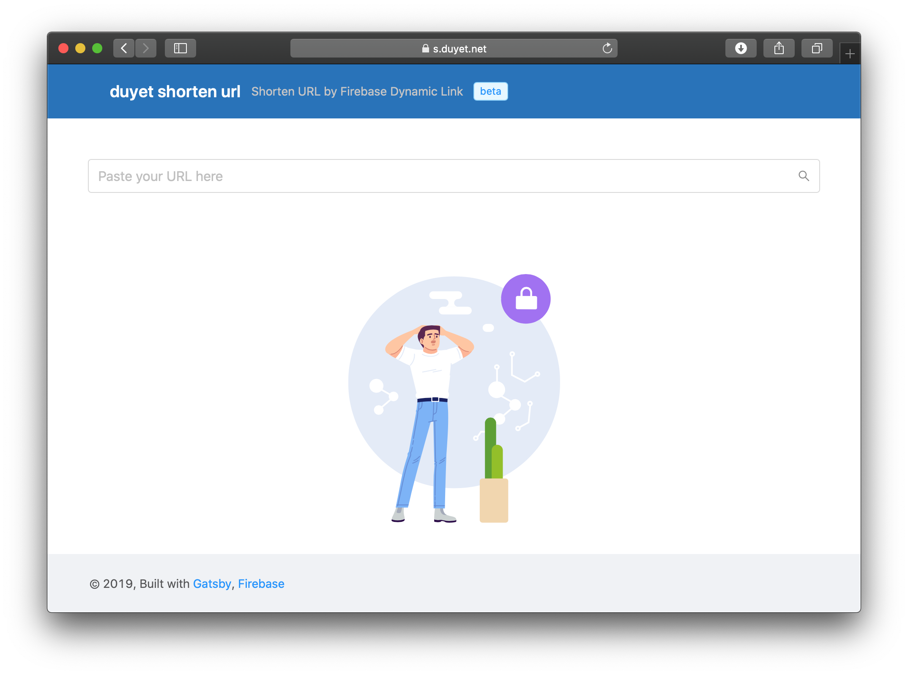
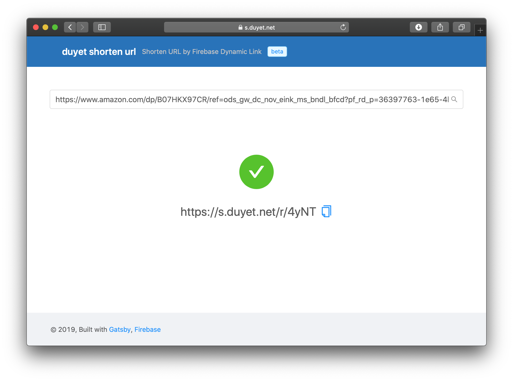

# Firebase Shorten URL
This is a demonstrate how to use the Firebase Dynamic Link API to build the shorten URL app.

Target:
 - Simple
 - Fast
 - Fast 😎

Live: https://s.duyet.net






# Locally development

1. Set up Node.js and the Firebase CLI
    ```
    yarn global add firebase-tools
    ```

    To initialize project: Run `firebase login` to log in via the browser and authenticate the firebase tool.


2. Setup packages
    ```
    cd functions/ && yarn
    cd hosting/ && yarn
    ```

3. Go to https://console.firebase.google.com and create new project.

4. Setup env variables, copy and modify `env.default.sh` to `env.local.sh`

   Get the api_key at **Project settings > General > Web API Key**

    ```
    firebase functions:config:set config.api_key=
    firebase functions:config:set config.domain_uri_prefix=
    ```
    Run: `bash ./env.local.sh`

5. Update the frontend config: `hosting/gatsby-config.js`:

 ```js
 module.exports = {
  siteMetadata: {
    title: 'duyet shorten url',
    description: 'Shorten URL by Firebase Dynamic Link',
    author: '@duyet',
  },
 ...
 ```

6. Running in local: https://firebase.google.com/docs/functions/local-emulator

    - Export local configs: `firebase functions:config:get > functions/.runtimeconfig.json`
    - Start firebase function: `firebase serve`
    - Start hosting local in another terminal: `cd hosting && yarn develop`
    - Open the UI in browser: http://localhost:8000

# Deploy

Deploy serverless functions and hosting to Firebase

```
firebase deploy
```


# Licence
MIT
